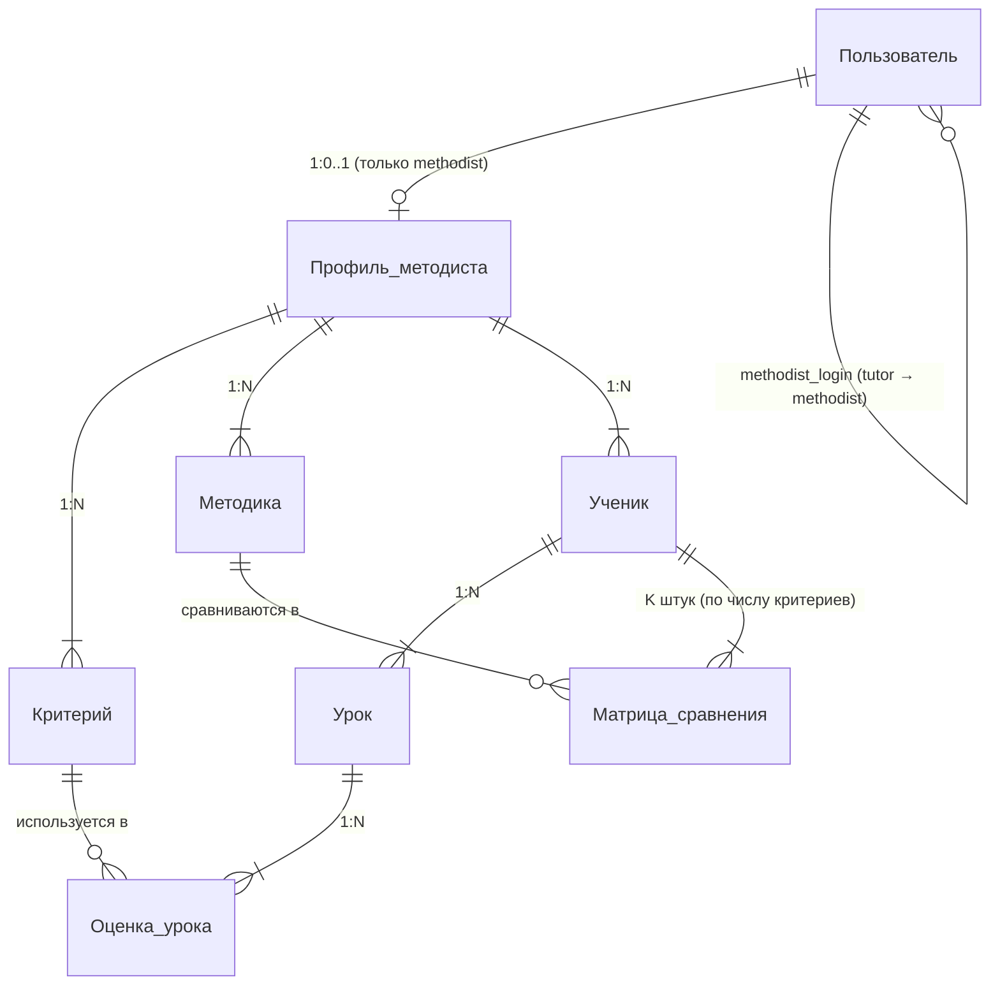
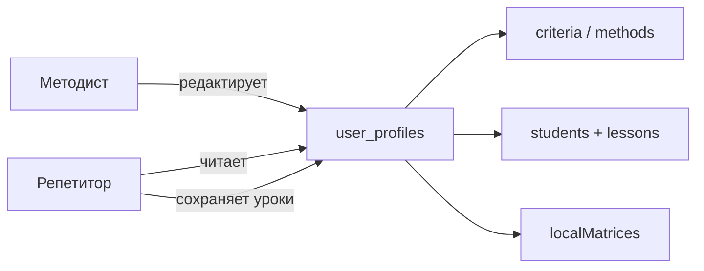

# Даталогическая модель данных (СУБД SQLite)

Документ описывает модель данных приложения «Подбор методики преподавания (МАИ)» для пояснительной записки.

---

## 1. Уровни представления

| Уровень | Описание |
|---------|----------|
| **Даталогический (логический)** | Сущности предметной области и связи между ними — без привязки к JSON |
| **Физический (SQLite)** | Две таблицы `users` и `user_profiles`; вложенные сущности — в JSON-колонках |

Реализация сознательно использует **документный подход**: профиль методиста хранится как один JSON-документ, что упрощает синхронизацию с SPA-клиентом.

---

## 2. Даталогическая модель (логический уровень)

### 2.1. Сущности

| Сущность | Описание | Ключ |
|----------|----------|------|
| **Пользователь** | Учётная запись в системе (методист или репетитор) | `login` |
| **Профиль методиста** | Набор правил и данных учеников | `login` → Пользователь |
| **Критерий** | Показатель оценки ученика (Теория, Графики, …) | `id` в рамках профиля |
| **Методика** | Способ обучения (Классическая, Практикум, …) | `id` в рамках профиля |
| **Ученик** | Обучающийся, для которого ведутся оценки и матрицы | `id` в рамках профиля |
| **Урок** | Занятие с датой и оценками по критериям | `id` в рамках ученика |
| **Оценка урока** | Балл по одному критерию на уроке (шкала 2–5) | пара `(lessonId, criterionId)` |
| **Матрица сравнения методик** | Парные сравнения методик по критерию (шкала Saaty, M×M) | пара `(studentId, criterionIndex)` |

### 2.2. Связи



### 2.3. Роли пользователей

| Роль | Код в БД | Профиль | Права |
|------|----------|---------|-------|
| Методист | `methodist` | есть `user_profiles` | критерии, методики, ученики, матрицы МАИ |
| Репетитор | `tutor` | нет (читает профиль методиста) | уроки, оценки, расписание, анализ |

Связь репетитора с методистом: `users.methodist_login → users.login`.

### 2.4. Атрибуты сущностей (логический уровень)

**Пользователь**
- login (PK)
- password_hash
- role ∈ {methodist, tutor}
- methodist_login (FK, только для tutor)
- created_at

**Профиль методиста**
- login (PK, FK)
- updated_at

**Критерий**
- id, name

**Методика**
- id, name

**Ученик**
- id, name, class, subject

**Урок**
- id, date, timeStart?, timeEnd?

**Оценка урока**
- criterionId → score (2..5, в анализе → 1..10)

**Матрица сравнения методик**
- K матриц размером M×M (M — число методик, K — число критериев)
- значения — шкала Saaty (1, 2, 3, …, 9, 1/2, 1/3, …)

---

## 3. Физическая модель (SQLite)

### 3.1. Таблица `users`

| Поле | Тип | Описание |
|------|-----|----------|
| login | TEXT PK | Логин |
| password_hash | TEXT | bcrypt-хеш пароля |
| role | TEXT | `methodist` или `tutor` |
| methodist_login | TEXT FK | Логин методиста (для репетитора) |
| created_at | TEXT | Дата регистрации |

### 3.2. Таблица `user_profiles`

| Поле | Тип | Сущности внутри JSON |
|------|-----|----------------------|
| login | TEXT PK, FK | — |
| criteria | TEXT (JSON) | Критерий[] |
| methods | TEXT (JSON) | Методика[] |
| students | TEXT (JSON) | Ученик[] (+ Урок, Оценка, Матрица) |
| criteria_importance | TEXT | *устарело* |
| method_scores | TEXT | *устарело* |
| local_matrices | TEXT | *устарело (глобальные матрицы)* |
| updated_at | TEXT | — |

### 3.3. Соответствие логических сущностей физическому хранению

| Логическая сущность | Где хранится |
|---------------------|--------------|
| Пользователь | `users` |
| Профиль методиста | `user_profiles` (строка методиста) |
| Критерий | `user_profiles.criteria[]` |
| Методика | `user_profiles.methods[]` |
| Ученик | `user_profiles.students[]` |
| Урок | `students[].lessons[]` |
| Оценка урока | `students[].lessons[].scores{}` |
| Матрица сравнения | `students[].localMatrices[][][]` |

---

## 4. JSON-схемы (фрагменты)

### Критерий и методика

```json
{ "id": "theory", "name": "Теория" }
{ "id": "m1", "name": "Классическая" }
```

### Ученик

```json
{
  "id": "s1",
  "name": "Денис",
  "class": "10",
  "subject": "математика",
  "lessons": [
    {
      "id": "l1",
      "date": "2026-05-21",
      "timeStart": "14:00",
      "timeEnd": "15:30",
      "scores": { "theory": 3, "graphs": 4 }
    }
  ],
  "localMatrices": [
    [[1, 2, 3, 4], [0.5, 1, 2, 3], [0.33, 0.5, 1, 2], [0.25, 0.33, 0.5, 1]]
  ]
}
```

`localMatrices[k][i][j]` — насколько методика *i* важнее методики *j* для критерия *k* (заполняется методистом).

---

## 5. Потоки данных по ролям



- **GET /api/me (methodist):** `users` + свой `user_profiles`
- **GET /api/me (tutor):** `users` + `user_profiles` методиста (`methodist_login`)
- **PUT /api/me (tutor):** обновляет только уроки/карточки учеников в профиле методиста

---

## 6. МАИ и данные БД

| Этап МАИ | Источник данных |
|----------|-----------------|
| Оценки ученика | `students[].lessons[].scores` |
| Веса критериев | вычисляются из дефицитов (не хранятся) |
| Матрицы методик | `students[].localMatrices` (задаёт методист) |
| Рекомендация | вычисляется на лету, в БД не сохраняется |

---

## 7. Файлы SQL в проекте

| Файл | Назначение |
|------|------------|
| `schema.sql` | DDL: создание таблиц |
| `queries.sql` | Примеры SELECT / INSERT / UPDATE |
| `seed_example.sql` | Тестовые данные (methodist + tutor1) |
| `01_schema.sql`, `02_queries_examples.sql`, `03_seed_example.sql` | Копии для листингов 2–4 в `LISTING.md` |

Схема автоматически применяется при старте сервера: `server/db.js → initSchema()`.
